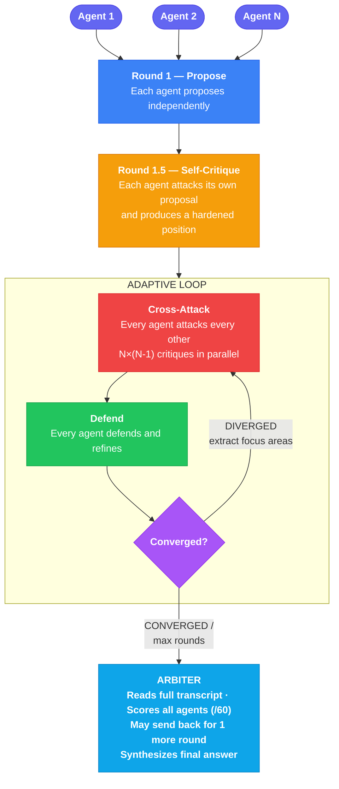

# Crucible

A Claude Code plugin that pits multiple AI agents against each other in adversarial debate. Agents independently propose solutions, self-critique, then attack and defend across adaptive rounds until they converge on the strongest answer. An arbiter scores every position and synthesizes the final result.


## How It Works



Debaters have access to `Read`, `Grep`, `Glob`, and `WebSearch` to gather evidence. The arbiter always uses Opus.

## Install

```bash
git clone https://github.com/sharifli4/crucible.git
```

Add to `~/.claude/settings.json`:

```json
{
  "pluginDirectories": ["/path/to/crucible"]
}
```

Or load for a single session:

```bash
claude --plugin-dir /path/to/crucible
```

Requires [Claude Code](https://claude.ai/code) with a valid Anthropic API key.

## Usage

```bash
/crucible [--agents N] [--model sonnet|opus] [--rounds N] <your task>
```

| Flag | Default | Description |
|------|---------|-------------|
| `--agents` | 2 | Number of debaters (2-5) |
| `--model` | sonnet | Model for debaters (`sonnet` or `opus`) |
| `--rounds` | 5 | Max cross-attack rounds (2-5, exits early on convergence) |

```bash
/crucible implement a thread-safe LRU cache in Python
/crucible --agents 3 should we use event sourcing or CRUD for a high-write system?
/crucible --agents 3 --model opus design a distributed consensus algorithm
```

## Structure

```
crucible/
├── .claude-plugin/plugin.json
├── commands/crucible.md
├── agents/
│   ├── debater.md
│   └── arbiter.md
└── README.md
```

## License

MIT
